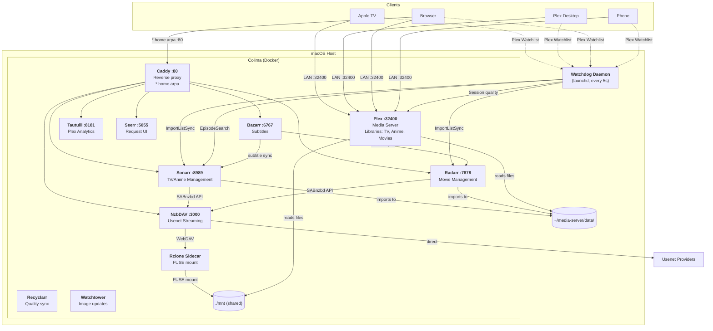

> [!NOTE]
> I used AI to build this. I don't have time or desire to become an expert in any of the various pieces of this stack, but I want to stream from usenet. 🤷‍♂️

# SlothServ — Self-Hosted Media Server

A self-hosted Usenet streaming setup on macOS using [Plex](https://www.plex.tv/), [NzbDAV](https://github.com/nzbdav/nzbdav), [Sonarr](https://sonarr.tv/), [Radarr](https://radarr.video/), and a custom watchdog daemon, running in [Docker](https://docs.docker.com/get-started/overview/) via [Colima](https://github.com/abiosoft/colima).

Add a show to your **Plex Watchlist** and within ~5 seconds the watchdog syncs it to Sonarr, auto-detects anime, and searches episodes one-by-one so the first episode is available as fast as possible.

> 📚 **Full documentation lives in the [wiki](../../wiki)** — setup, every watchdog handler, CLI tools, troubleshooting, and known limitations. This README covers the fast path; the wiki covers everything else.

## Architecture



### Services

| Service | Port | Purpose |
|---------|------|---------|
| Plex | 32400 | Media server — TV, anime, and movie libraries |
| NzbDAV | 3000 | Usenet streaming client (SABnzbd-compatible API) |
| Rclone | — | FUSE sidecar — mounts NzbDAV's WebDAV as a local filesystem |
| Sonarr | 8989 | TV & anime series management and search |
| Radarr | 7878 | Movie management and search |
| Bazarr | 6767 | Automatic subtitle downloads |
| Tautulli | 8181 | Plex analytics and playback history |
| Seerr | 5055 | Content request UI for end users |
| Caddy | 80 | Reverse proxy — exposes each service at `<name>.home.arpa` |
| Recyclarr | — | Syncs TRaSH quality profiles to Sonarr/Radarr |
| Watchtower | — | Automatic weekly container image updates |

### What the watchdog handles automatically

| Problem | Without watchdog | With watchdog |
|---------|-----------------|---------------|
| Plex Watchlist sync | Sonarr polls every 6 hours | Synced every 5 seconds |
| Anime misrouted to TV folder | Manual fix required | Auto-detected by genre, rerouted |
| Sonarr batch search delays | All episodes evaluated before any grabbed | Episodes searched one-by-one |
| Queue import warnings | Manual import required | Auto force-imported via ManualImport API + Plex partial scan |
| Anime import blocking | "Matched by ID" blocks auto-import | Symlinks created directly, series refreshed, Plex scanned |
| Failed downloads | Stuck until manual intervention | Auto-removed and re-searched |
| Blocklist death spiral | Episode permanently stuck | Native auto-blocklist entries cleared within a 10-minute window |
| Orphaned missing episodes | Stay missing forever | Re-searched every 6h |
| Truncated episodes | Appear complete, play only minutes | Detected by duration, re-searched |
| Plex quality degradation | Unnoticed | Logged with details |
| Colima port forwarding dies | Services unreachable | VM IP failover, auto-restart |
| Database corruption | Silent failures | Hourly health check, auto-repair |
| Stale import list cache | Watchlist ignored | Auto-recreated after 4h of persistent mismatch |
| Missing Usenet articles | Corrupt playback, freezes | Detected and flagged for re-download |
| Plex LAN IP drift | Clients fall back to remote relay after DHCP change | Detected via the default route, `customConnections` rewritten, Plex restarted (deferred during active playback) |
| Config backups | Manual or forgotten | Daily compressed tarball |

See the [Watchdog wiki page](../../wiki/Watchdog-Daemon) for detailed handler descriptions.

## Quick Start

### Fresh Install

```bash
bash <(curl -fsSL https://raw.githubusercontent.com/carterhudson/slothserv/main/bootstrap.sh)
```

Or if you already have the repo cloned:

```bash
bash ~/media-server/bootstrap.sh
```

The script is interactive and provider-agnostic — it prompts for your indexer and credentials. It handles everything: Homebrew, Colima, Docker, config files, Sonarr/Radarr API configuration, watchdog daemon, and shell aliases.

### Config Export / Import

Snapshot your credentials for easy migration to another machine:

```bash
bash bootstrap.sh --export slothserv-config.json   # save
bash bootstrap.sh --import slothserv-config.json   # restore (only asks for Plex claim token)
```

The exported file contains secrets — treat it like a password manager export.

### What you'll need

| Credential | Where to get it |
|------------|----------------|
| Usenet indexer API key | Your Newznab-compatible indexer (e.g. NzbGEEK) |
| Indexer Newznab URL | The API base URL for your indexer |
| NzbDAV WebDAV password | You choose one (set in NzbDAV UI after boot) |
| Plex claim token | https://plex.tv/claim (expires in 4 min) |

### After bootstrap finishes

1. Claim Plex at http://plex.home.arpa (or http://localhost:32400/web)
2. Create libraries: TV → `/tv`, Anime → `/anime`, Movies → `/movies`
3. Configure NzbDAV's Usenet provider and Sonarr integration at http://nzbdav.home.arpa
4. Add the Plex Watchlist import list in Sonarr and Radarr

> [!TIP]
> The watchdog keeps Plex's `customConnections` in sync with your Mac's current LAN IP automatically, so LAN clients don't fall back to Plex's remote relay after a DHCP lease change. You only need to touch this setting if you want to add extra entries (e.g. a hostname or tunnel address).

### Accessing services by hostname

Bootstrap patches `/etc/hosts` on the server machine with a marked block pointing every `*.home.arpa` name at `127.0.0.1`, so Caddy can route them to the right container:

| URL | Service |
|-----|---------|
| http://plex.home.arpa | Plex |
| http://sonarr.home.arpa | Sonarr |
| http://radarr.home.arpa | Radarr |
| http://bazarr.home.arpa | Bazarr |
| http://tautulli.home.arpa | Tautulli |
| http://seerr.home.arpa | Seerr |
| http://nzbdav.home.arpa | NzbDAV |

From a **second machine on your LAN**, either add the same hostnames to that machine's hosts file (pointing at the Mac's LAN IP) or keep using `http://<mac-ip>:<port>`. The `.home.arpa` TLD is reserved by [RFC 8375](https://datatracker.ietf.org/doc/html/rfc8375) for exactly this — it's guaranteed never to collide with a real domain.

## Requesting Content

1. Add a show/movie to your **Plex Watchlist** from any Plex client
2. Within ~5 seconds, the watchdog syncs it to Sonarr/Radarr
3. Anime is auto-rerouted to the anime library with the correct profile
4. Episodes are searched one-by-one — first episode available in seconds
5. Plex auto-scans and it appears in your library

You never need to touch Sonarr, Radarr, or any admin UI. Just watchlist and wait.

## Directory Layout

```
media-server/
├── scripts/
│   ├── watchdog/              # Daemon (launchd, every 5s)
│   │   ├── __main__.py        # Entry point + main loop
│   │   ├── config.py          # Constants, state, logging
│   │   ├── api.py             # HTTP helpers for Sonarr, Radarr, Plex
│   │   ├── sonarr.py          # Watchlist sync, new series, imports, blocklist,
│   │   │                      #   sweep, anime symlink reconciliation
│   │   ├── radarr.py          # Stuck imports, failed downloads
│   │   ├── plex.py            # Session monitoring, truncation detection
│   │   ├── health.py          # DB integrity + import list staleness
│   │   ├── nzbdav.py          # Missing article detection
│   │   ├── backup.py          # Daily config backup (incl. NzbDAV named volume)
│   │   ├── connectivity.py    # Colima/Docker network failover
│   │   ├── plex_network.py    # Auto-sync Plex customConnections with LAN IP
│   │   └── vpn.py             # VPN health check (optional; no-op if gluetun isn't deployed)
│   ├── cli/                   # Manual CLI tools
│   │   ├── status.py          # mstatus — dashboard
│   │   ├── episode-search.py  # msearch — targeted search
│   │   ├── retry-failed.py    # mretry — retry failures
│   │   ├── up.sh              # mup — start stack
│   │   ├── down.sh            # mdown — graceful shutdown
│   │   └── auto-import.py
│   └── setup/                 # Bootstrap helpers
│       ├── configure.py
│       └── export-config.py
├── config/                    # Persistent service config (gitignored)
├── data/media/                # TV, anime, movies (gitignored)
├── mnt/                       # Rclone FUSE mount point
├── docker-compose.yml
├── rclone.conf
├── bootstrap.sh
└── .env                       # Secrets (gitignored)
```

### NzbDAV Named Volume

NzbDAV's `/config` directory (including its SQLite database) lives on a **Docker named volume** (`nzbdav_config`) rather than a bind mount. This keeps the database on the Colima VM's native ext4 filesystem, avoiding SQLite WAL corruption issues with macOS's `virtiofs` shared filesystem. The watchdog's `backup.py` module uses `docker cp` to include it in daily backups.

## Shell Aliases

| Alias | Command | Purpose |
|-------|---------|---------|
| `mstatus` | `python3 ~/media-server/scripts/cli/status.py` | Status dashboard |
| `msearch` | `python3 ~/media-server/scripts/cli/episode-search.py` | Episode-by-episode search |
| `mretry` | `python3 ~/media-server/scripts/cli/retry-failed.py` | Retry failed downloads |
| `mlogs` | `tail -30 ~/media-server/logs/watchdog.log` | Recent watchdog activity |
| `mup` | `bash ~/media-server/scripts/cli/up.sh` | Start Colima + stack + watchdog |
| `mdown` | `bash ~/media-server/scripts/cli/down.sh` | Graceful shutdown (watchdog → rclone → containers → Colima) |
| `mrestart` | `mdown && mup` | Full stack restart |

## Common Commands

```bash
mup                                   # Start everything (Colima + Docker + watchdog)
mdown                                 # Graceful shutdown of entire stack
mstatus                               # Quick health dashboard
mlogs                                 # Tail watchdog log

docker compose logs -f sonarr         # Live logs for a service
docker compose restart plex           # Restart a single service
docker compose pull && docker compose up -d  # Update images (or let Watchtower do it)
```

## Documentation

**Start here → [SlothServ Wiki](../../wiki)**

The wiki is the source of truth for anything beyond the fast path:

| Page | What's in it |
|------|---------------|
| **[Service Configuration](../../wiki/Service-Configuration)** | Colima tuning, `.env` vars, Sonarr/Radarr quality profiles + custom formats, NzbDAV, Plex `Preferences.xml`, Rclone flags, Caddy reverse proxy, optional Gluetun VPN |
| **[Watchdog Daemon](../../wiki/Watchdog-Daemon)** | Every handler in execution order, isolated per-step error handling, all 5s / 1h / 4h / 6h intervals, key constants, logging, launchd plist |
| **[CLI Tools](../../wiki/CLI-Tools)** | `mstatus`, `msearch`, `mretry`, `mup`, `mdown`, and what each one does under the hood |
| **[Troubleshooting](../../wiki/Troubleshooting)** | Relayed Plex streams, empty rclone mount, database corruption, `*.home.arpa` resolution, Colima port forwarding |
| **[Known Limitations](../../wiki/Known-Limitations)** | SQLite on virtiofs, Mac sleep, anime naming quirks, Plex LAN IP changes |
